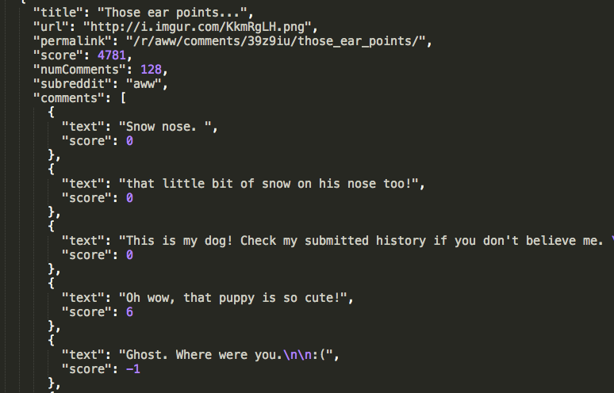

measuring-emotions-on-reddit
===

In order to analyze human emotion in social networks, I used sentiment analysis on hundreds of comments on reddit.com. In this post, you'll see how I parsed through reddit's somewhat messy API, and found the sum sentiment scores for the top 50 subreddits. 

Reddit, is more than just a place to get updated on worldnews, look at cute pictures of puppies, and hear about the latest edition of world of warcraft. Reddit has become a community where millions of people gather every day to view and post their thoughts, opinions, and views on thousands of different topics. Reddit is great because it's public API allows access to lots of useful data just by adding ".json" to the end of the post's url. However, as you can see below, the API is somewhat hard to navigate. 

<div align="left">
        
        
</div>


I parsed the API, taking out the relevant information needed for my analysis. Here is a sample of my cleaned-up json:

<div align="left">
        
        
</div>


With my new easy to navigate json, I ran a sentiment analysis test on all of the comments of each post on each subreddit. Sentiment is a Node.js modulue that uses a preset worldlist, where each block of test is scored based on the negative or positive value of each word. Below is an example of how the sentiment analysis works:

```
"You're dad is adorable and I want to adopt him." -Score: 5
"It is incredible how many idiots are around us. Reddit is an idiot magnet" -Score: -3
```
Sometimes, the sentiment scores can be off, due to sentiment's failure to understand context, as seen below:

```
"You cheeky bastard. Lemme get your number." -Score: -5
```

However, by examining thousands of comments, the sum score pretty much averages out. 

Aside from the easy to access API, I chose to anaylyze reddit because it covers such a broad range of topics, and is utilized by such a wide range of people. I performed the analysis on the top 50 subreddits. 

This graph shows the sum sentiment scores of the top 50 subreddits from negative to positive. 

<div align="left">
        
        
</div>

As you can see, the subreddit "IAmA" has the highest sum sentiment scores. With the "IAmA" subreddit, users post what they do in life, and people can comment, ask questions, ect. Let's look at a few posts in this subreddit to see what sentiment analysis found. 

**Subreddit: I Am A**

**Post:** "We're the Google Flights team, makers of flight search related stuff. Ask us anything!"

This post in particular had 329 total comments, which I easily found from parsing the API. Of the 329 comments, there were some negative comments, such as:
 	
 ```"Why did you eliminate the list view of flights? The graphic map might be neat to look at but it is a time waster for business travelers. You lost my business." -Score: -3```

 and many positive comments, such as:

```"I love the new amenity data on the site. Are there any plans to expand that? Mostly interested in more WiFi info and entertainment, to be honest." -Score: 8 ```

 

In contrast to the subreddit "IAmA", the subreddit with the lowest sum sentiment score was "AskReddit". Below are a couple comments that definitely helped "AskReddit" become the most negative subreddit.

**Subreddit: Ask Reddit**

**Post:** "Married men, how's your relationship with your mother-in-law?"

```"I've kicked her out of my house twice. I hate her and she hates me. I have practiced looking upset when my wife calls to tell me she is dead. I will dance on her grave. " Score: -13 ```

**Post:** "Previous active users of /r/fatpeoplehate, why do you hate fat people?"

```"I hate fatties because of excuses and also many are type 2 diabetic. I'm a type 1 for 17 years almost and whenever I mention  my diabetes people say how you aren't fat or you don't look fat. I don't like being categorized with sacks of shit who don't give a fuck about their bodies to the point where they get a serious disability. Also many people won't donate to diabetic charities because when people here diabetes they think fat lazy people who put themselves in the position that that are when in reality type 1s didn't do shit to get diabetes but type 2s got it by not caring about themselves. " Score: -14 ```

**Post:** "If you and only you were anonymously allowed to kill people, would you ?"

```"No, I'm not the government." Score: -1 ```

Another extremely negative subreddit was "News". Shocking! Here are a couple comments from this subreddit:

**Subreddit:** News

**Post:** "Texas police shut down girls' lemonade stand, demand permit"

```"Wait, they made $25 in an hour? Well fuck my job I'm gonna go sell some juice."```

**Post:** "Mother accused of leaving kids in car on hot day goes to court, leaves kids in car."

```"At least she's consistently horrible. " Score: -3```


*6-4-15*
