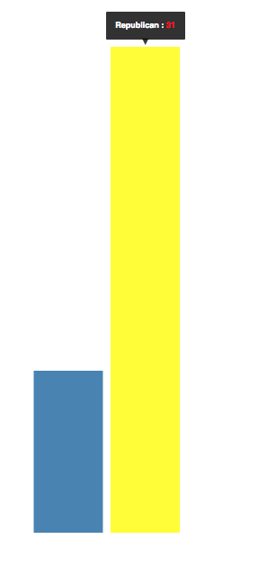
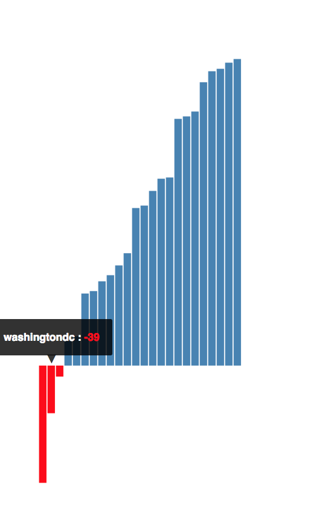

measuring-emotions-on-reddit
===

In order to analyze human emotion in social networks, I used sentiment analysis on comments from the 50 top subreddits. In this post, you'll see how I parsed through reddit's somewhat messy API, and found the sum sentiment scores for the top 50 subreddits. 

Reddit, is more than just a place to get updated on worldnews, look at cute pictures of puppies, and hear about the latest edition of world of warcraft. Reddit has become a community where millions of people gather every day to view and post their thoughts, opinions, and views on thousands of different topics. Reddit has a straightforward JSON API; access a JSON representation of any page by appending '.json' to the URL. Here is a comment taken from the subreddit [aww](http://www.reddit.com/r/aww/comments/3a1cba/this_is_ollie_hes_ready_for_business). 

<div align="center">
        
        
</div>


I parsed the API, taking out the relevant information needed for my analysis. Here is a sample of my cleaned-up json:

<div align="center">
        
        
</div>

- - -

With my new easy to navigate json, I ran a sentiment analysis test on all of the comments of each post on each subreddit. Sentiment, created by [@thisandagain](https://github.com/thisandagain, is a Node.js modulue that uses a preset worldlist, where each block of test is scored based on the negative or positive value of each word. Below is an example of how the sentiment analysis works:

```
"You're dad is adorable and I want to adopt him." -Score: 5
"It is incredible how many idiots are around us. Reddit is an idiot magnet" -Score: -3
```
Sometimes, the sentiment scores can be off, due to sentiment's failure to understand context, as seen below:

```
"Holy fuck. That's like weaponized cuteness right there." Score: -2
```

However, by examining thousands of comments, the sum score pretty much averages out. 

- - -

Aside from the easy to access API, I chose to anaylyze reddit because it covers such a broad range of topics, and is utilized by such a wide range of people. I performed the analysis on the top 50 subreddits. 

This graph shows the sum sentiment scores of the top 50 subreddits from negative to positive. 

<div align="center">
        
        
</div>

As you can see, the subreddit "IAmA" has the highest sum sentiment scores. With the "I Am A" subreddit, users post what they do in life, and people can comment, ask questions, ect. The subreddit with the most negative sum sentiment score was "AskReddit", where users can ask reddit anything. 

- - -
After analyzing the top 50 subreddits, I looked into contrasting subreddits.

###Highlight comparisons###

                                                Cats vs Dogs

<div align="center">
        
        
</div>

                                        Replublicans vs Democrats
<div align="center">
        
        
</div>

- - -

Finally, I analyzed the top 25 U.S. cities. The top 25 cities ranked according to population and rank respectively include: 

```
1.New York City         6. Philadelphia         11. Austin              16. Fortworth           21. Denver 
2.Los Angeles           7. Phoenix              12. Jacksonville        17. Charlotte           22. Washington DC     
3.Chicago               8. San Antonio          13. San Francisco       18. Detroit             23. Memphis
4.Houston               9. Dallas               14. Indianapolis        19. El Paso             24. Boston
5.Philadelphia          10. San Jose            15. Columbus            20. Seattle             25. Nashville
```

Here you can see the different sum sentiment scores of each U.S. city. 

<div align="left">
        
        
        
</div>


Whether you want to analyze how people feel about your favorite sports teams, the country you're visiting this summer, or the candidates for the presidential election, using sentiment anaylsis can quickly determine the human emotions on thousands of different topics. 

- - -
*6-4-15*
